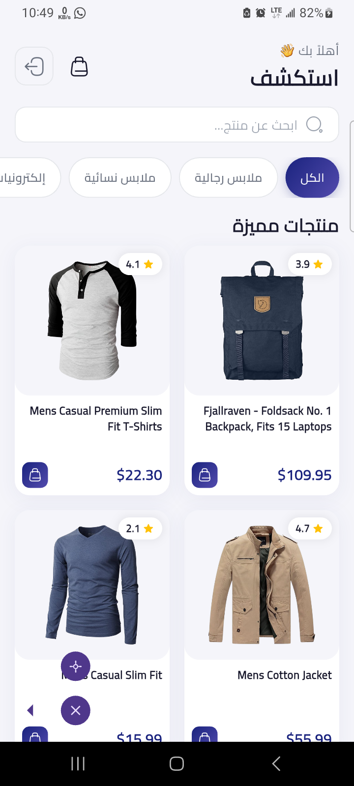
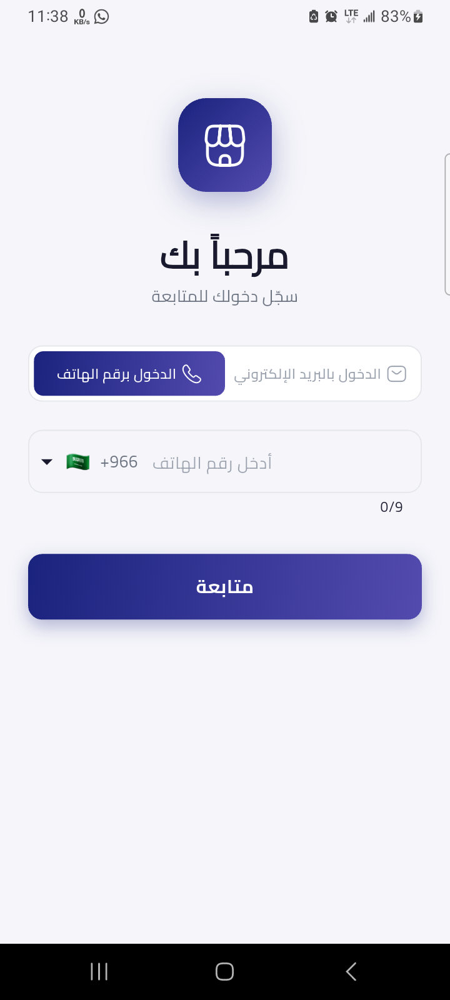

<p align="center">
  
    
</p>

<h1 align="center">🛍️ Mini Store — ميني ستور</h1>

<p align="center">
  <strong>A modern, production-ready e-commerce mobile application built with Flutter & Clean Architecture</strong>
</p>

<p align="center">
  
  
  
  
  
</p>

---

## 📖 Overview

**Mini Store (ميني ستور)** is a fully-featured e-commerce mobile application designed with a focus on **Clean Architecture**, **scalability**, and a **premium Arabic-first user experience**. The app fetches real product data from an external API and provides users with a seamless shopping flow — from browsing and searching products to viewing details, rating items, and managing a cart.

Built entirely with **Flutter** and powered by the **BLoC/Cubit** pattern for state management, Mini Store follows industry-standard best practices including layered architecture, dependency injection, and centralized error handling.

---

## ✨ Features

### 🔐 Authentication
- **Dual Login Methods** — Email/Password and Phone Number (OTP) based authentication
- **OTP Verification** — Secure one-time password verification screen with PIN input
- **Persistent Session** — Auth state persisted locally via `SharedPreferences`
- **Auto-Routing** — Automatic navigation based on authentication status (splash → login → home)

### 🏠 Home & Product Browsing
- **Product Catalog** — Browse a full catalog of products fetched from a REST API
- **Category Filtering** — Filter products by category (Electronics, Jewelry, Men's Clothing, Women's Clothing)
- **Product Search** — Quick search functionality to find products instantly
- **Shimmer Loading** — Elegant loading placeholders while data is being fetched
- **Staggered Animations** — Smooth entry animations for product cards

### 📦 Product Details
- **Rich Product View** — Full-screen product details with hero image, description, and pricing
- **Star Ratings** — Visual rating display with rating count
- **Add to Cart** — One-tap add to cart with visual feedback

### 🛒 Shopping Cart
- **Cart Management** — Add, remove, and track items in the cart
- **Cart Badge** — Real-time cart item count displayed on the app bar
- **State Persistence** — Cart state managed via Cubit

### 🌐 Localization & RTL
- **Arabic-First UI** — All text content in Arabic with full RTL layout support
- **Cairo Typography** — Beautiful Arabic typography using Google Fonts (Cairo)
- **Flutter Localization** — Proper locale delegates for Material, Cupertino, and Widgets

---

## 🏗️ Architecture

The project follows **Clean Architecture** principles, ensuring separation of concerns, testability, and maintainability.

```
lib/
├── app/                          # App entry point & configuration
│   ├── app.dart                  # MaterialApp with routing & providers
│   └── di.dart                   # Dependency injection (GetIt)
│
├── core/                         # Shared infrastructure & utilities
│   ├── constants/                # App-wide constants
│   │   ├── app_colors.dart       # Color palette (Deep Indigo + Amber Gold)
│   │   ├── app_dimens.dart       # Spacing & dimension tokens
│   │   ├── app_strings.dart      # All Arabic UI strings (centralized)
│   │   └── app_styles.dart       # Common text styles
│   ├── error/                    # Error handling
│   │   ├── exceptions.dart       # Custom exceptions
│   │   └── failures.dart         # Failure types (for Either pattern)
│   ├── network/                  # Networking layer
│   │   ├── api_client.dart       # Dio HTTP client configuration
│   │   └── api_endpoints.dart    # API endpoint constants
│   ├── theme/
│   │   └── app_theme.dart        # Material 3 theme configuration
│   ├── utils/
│   │   └── validators.dart       # Form validation utilities
│   └── widgets/                  # Reusable UI components
│       ├── app_button.dart       # Custom button widget
│       ├── app_text_field.dart   # Custom text field widget
│       ├── cached_image.dart     # Network image with caching
│       ├── error_view.dart       # Error state display
│       └── loading_shimmer.dart  # Shimmer loading placeholder
│
├── features/                     # Feature modules
│   ├── auth/                     # Authentication feature
│   │   ├── data/
│   │   │   ├── datasources/      # Local auth data source
│   │   │   └── repositories/     # Auth repository implementation
│   │   ├── domain/
│   │   │   ├── repositories/     # Auth repository contract
│   │   │   └── usecases/         # LoginWithEmail, LoginWithPhone, VerifyOtp, Logout, CheckLoginStatus
│   │   └── presentation/
│   │       ├── cubit/            # AuthCubit + AuthState
│   │       └── screens/          # LoginScreen, OtpScreen
│   │
│   ├── products/                 # Products feature
│   │   ├── data/
│   │   │   ├── datasources/      # Remote API data source (FakeStore API)
│   │   │   ├── models/           # ProductModel (JSON ↔ Entity mapping)
│   │   │   └── repositories/     # Products repository implementation
│   │   ├── domain/
│   │   │   ├── entities/         # Product entity
│   │   │   ├── repositories/     # Products repository contract
│   │   │   └── usecases/         # GetProducts use case
│   │   └── presentation/
│   │       ├── cubit/            # ProductsCubit + ProductsState
│   │       ├── screens/          # HomeScreen, ProductDetailsScreen
│   │       └── widgets/          # ProductCard, CategoryChips
│   │
│   └── cart/                     # Cart feature
│       └── presentation/
│           ├── cubit/            # CartCubit + CartState
│           └── widgets/          # CartBadge
│
└── main.dart                     # App entry point
```

### Layer Responsibilities

| Layer | Responsibility | Key Classes |
|-------|---------------|-------------|
| **Domain** | Business logic & contracts | `Product`, `AuthRepository`, `GetProducts`, `LoginWithEmail` |
| **Data** | API calls, models, repo implementations | `ProductModel`, `ProductsRemoteSource`, `AuthLocalSource` |
| **Presentation** | UI + State Management | `HomeScreen`, `ProductsCubit`, `AuthCubit` |
| **Core** | Cross-cutting concerns | `ApiClient`, `AppTheme`, `Validators`, `Failures` |

---

## 🎨 Design System

### Color Palette

| Role | Color | Hex |
|------|-------|-----|
| **Primary** | 🟦 Deep Indigo | `#1A237E` |
| **Primary Light** | 🟪 Soft Indigo | `#534BAE` |
| **Accent** | 🟡 Amber Gold | `#FFB300` |
| **Accent Light** | 🟨 Light Gold | `#FFE54C` |
| **Background** | ⬜ Soft Lavender | `#F5F5FA` |
| **Text Primary** | ⬛ Dark Navy | `#1A1A2E` |
| **Error** | 🟥 Red | `#D32F2F` |
| **Success** | 🟩 Green | `#2E7D32` |

### Typography
- **Font Family**: [Cairo](https://fonts.google.com/specimen/Cairo) — optimized for Arabic readability
- **Framework**: Material 3 with custom theme overrides

---

## 🧩 Tech Stack

| Category | Technology | Purpose |
|----------|-----------|---------|
| **Framework** | Flutter 3.8+ | Cross-platform UI |
| **Language** | Dart 3.8+ | Type-safe development |
| **State Management** | `flutter_bloc` / Cubit | Predictable state management |
| **Networking** | `dio` | HTTP client with interceptors |
| **Dependency Injection** | `get_it` | Service locator pattern |
| **Local Storage** | `shared_preferences` | Key-value persistence |
| **Functional Programming** | `dartz` | `Either` type for error handling |
| **Equality** | `equatable` | Value equality for states & entities |
| **Image Caching** | `cached_network_image` | Efficient image loading & caching |
| **Loading States** | `shimmer` | Skeleton loading placeholders |
| **Typography** | `google_fonts` | Cairo font for Arabic support |
| **Animations** | `flutter_staggered_animations`, `animate_do` | Smooth UI animations |
| **Phone Input** | `intl_phone_field` | International phone number input |
| **OTP Input** | `pinput` | OTP pin code input |
| **Ratings** | `flutter_rating_bar` | Star rating display |
| **Icons** | `iconsax`, `cupertino_icons` | Modern icon sets |

---

## 🔌 API

The app consumes the [Fake Store API](https://fakestoreapi.com/) for product data.

| Endpoint | Method | Description |
|----------|--------|-------------|
| `/products` | `GET` | Fetch all products |

**Base URL**: `https://fakestoreapi.com`

---

## 🚀 Getting Started

### Prerequisites

- **Flutter SDK** `>= 3.8.1`
- **Dart SDK** `>= 3.8.1`
- **Android Studio** / **VS Code** with Flutter extension
- An **Android emulator** or **iOS Simulator** (or a physical device)

### Installation

1. **Clone the repository**
   ```bash
   git clone https://github.com/your-username/mini_store.git
   cd mini_store
   ```

2. **Install dependencies**
   ```bash
   flutter pub get
   ```

3. **Run the app**
   ```bash
   flutter run
   ```

4. **Build for production** *(optional)*
   ```bash
   # Android APK
   flutter build apk --release

   # Android App Bundle
   flutter build appbundle --release

   # iOS
   flutter build ios --release
   ```

---

## 🧪 Running Tests

```bash
# Run all unit and widget tests
flutter test

# Run tests with coverage
flutter test --coverage
```

---

## 📁 Key Design Decisions

### Why Clean Architecture?
- **Separation of concerns** — Each layer has a single responsibility
- **Testability** — Domain and data layers can be tested independently
- **Scalability** — New features can be added as isolated modules
- **Replaceability** — Swap data sources (API, local DB) without touching business logic

### Why BLoC/Cubit?
- **Predictable state** — Unidirectional data flow makes debugging easier
- **Reactive UI** — `BlocBuilder` / `BlocListener` for efficient rebuilds
- **Separation** — Business logic stays in Cubit, UI stays in widgets
- **Testability** — Cubits are plain Dart classes, easily unit-tested

### Why GetIt for DI?
- **Lightweight** — No code generation or boilerplate
- **Lazy singletons** — Dependencies initialized only when needed
- **Clean setup** — Single `di.dart` file wires everything together

### Why Dartz (Either)?
- **Explicit error handling** — No uncaught exceptions; every operation returns `Either<Failure, Success>`
- **Functional composition** — `fold`, `map`, and `flatMap` for clean control flow

---

## 🤝 Contributing

Contributions are welcome! Please follow these steps:

1. **Fork** the repository
2. **Create** a feature branch (`git checkout -b feature/amazing-feature`)
3. **Commit** your changes (`git commit -m 'Add amazing feature'`)
4. **Push** to the branch (`git push origin feature/amazing-feature`)
5. **Open** a Pull Request

### Code Style
- Follow the [Dart style guide](https://dart.dev/guides/language/effective-dart/style)
- Use the project's `analysis_options.yaml` for linting rules
- Keep all strings centralized in `AppStrings`


---

<p align="center">
  Made with ❤️ and Flutter
</p>
